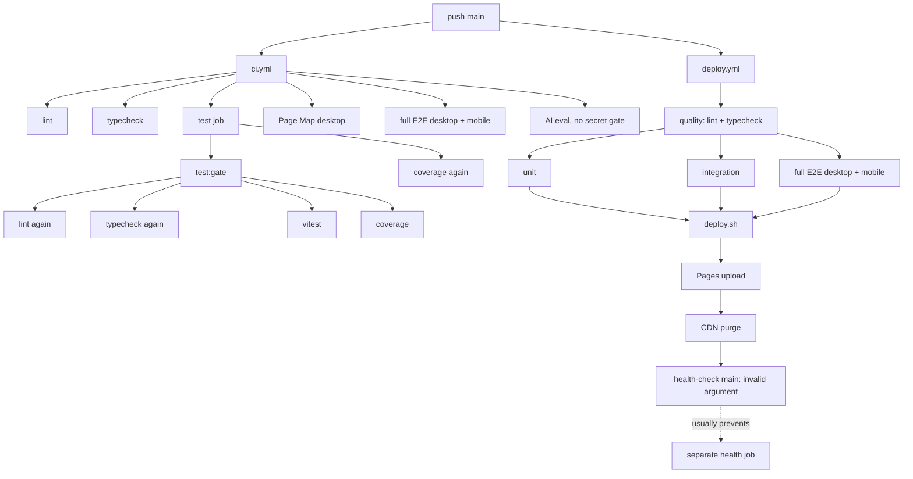
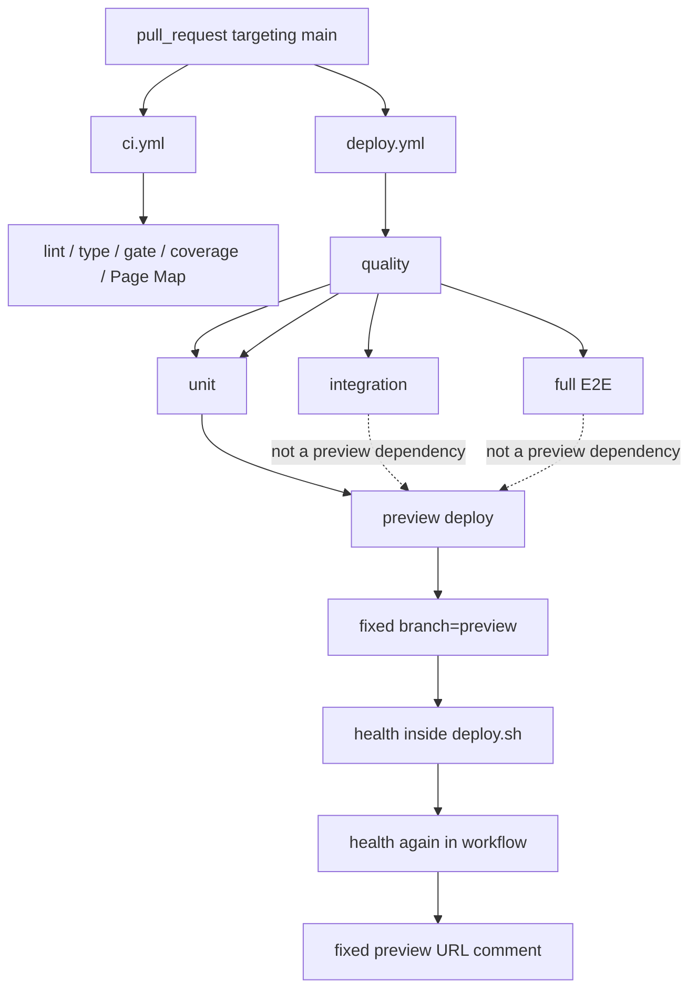

# CI、部署与 Playwright 发布链路审计

审计日期：2026-08-13

## 结论摘要

当前仓库没有一条可信的“验证通过的不可变产物 → 部署 → 精确 smoke”链路，而是两条互不依赖、同时被 `push main` 和 `pull_request main` 触发的 workflow：

- `.github/workflows/ci.yml` 做 lint、typecheck、复合 quality gate、coverage、Page Map、main full E2E 和 main AI evaluation。
- `.github/workflows/deploy.yml` 又做 lint、typecheck、unit、integration、PR/main full E2E，然后直接从 checkout 工作区重新 staging 并部署。

这会造成四类发布风险：

1. **重复验证但没有跨 workflow 门禁**：`deploy.yml` 不消费 `ci.yml` 的结论；CI 红灯不能阻止另一条 workflow 的 preview，且 main 的同一 Page Map 测试最多执行 5 次。
2. **构建失败可继续部署**：Functions build 和 asset hash 都是 fail-open；当前 deploy staging 也不是 allowlist artifact。
3. **部署后状态不诚实**：production 上传和 purge 已完成后，`deploy.sh` 把 `main` 传给不接受该参数的 health check，job 才失败，可能出现“线上已变更、Actions 显示 deploy 失败”。
4. **事件/权限边界不安全且不稳定**：fork/Dependabot PR 没有部署 secret，PR 评论也依赖未声明的写权限；直接把部署 secret 放进执行 PR checkout/脚本的 workflow 不应作为修复方案。

推荐目标是：

```text
ci.yml（唯一验证入口，无部署凭据）
  checkout exact event SHA + Node 22.19.0 + npm ci
    ├─ static: lint + typecheck + test QA（每项一次）
    ├─ tests: unit/integration/frontend/cross-layer + coverage（每套一次）
    ├─ e2e: PR=Page Map desktop；main=full（互斥，只跑一次）
    └─ ai-eval: main 且任一 provider secret 存在才执行；否则显式成功 SKIP
          ↓ all required jobs success
  allowlist artifact build
    → Functions build
    → asset hash
    → secret/file safety validation
    → sorted manifest + SHA-256 + source identity
    → upload immutable artifact
          ↓ workflow_run(completed) + conclusion/source/repo/SHA gates
deploy.yml（受信 consumer，不执行 PR 代码）
    ├─ same-repo PR → exact artifact → pr-N preview → exact URL smoke → comment
    └─ main push    → exact artifact → production environment → exact URL smoke
```

## 审计边界与证据状态

- 只读检查了 `.github/workflows/ci.yml`、`.github/workflows/deploy.yml`、`playwright.config.ts`、`package.json`、Vitest workspace/config、测试入口、`scripts/deploy.sh`、`scripts/health-check.sh`、`scripts/hash-assets.js`、`scripts/quality-gate.sh`、`scripts/eval-loop.sh` 和部署指南。
- 查阅了 GitHub Actions、GitHub artifact/secret/permissions 及 Cloudflare Pages preview 的官方文档。
- 未运行 Playwright/Vitest，未触发 hosted Actions、远程部署、CDN purge 或远程 health check。
- 审计期间共享工作树出现了其他 agent 的产品文件改动；本研究没有触碰或回滚这些改动。`.github/workflows/*`、`playwright.config.ts` 和本文涉及的脚本在本次审计中未被本研究修改。
- `scripts/deploy.sh` 等文件在初始证据读取后被并行实现 agent 修改；本文的“当前证据”与行号明确描述审计开始时的基线快照。实施/复核时必须对最新 diff 重新跑 contract audit，不能把这些行号当作并行改动后的现状。
- 因未访问 GitHub hosted run、仓库 Actions settings、required checks、GitHub Environments 或 Cloudflare 项目设置，云端默认权限、secret 是否已配置、environment protection 和当前 hosted CI 状态均为 **unknown**。

## 1. 当前依赖图

### 1.1 main push



两条 workflow 没有 `needs`、artifact 或 hosted check 层面的连接。`deploy.yml` 自身的绿灯不能证明 `ci.yml` 通过，反之亦然。

### 1.2 pull request



`preview` 只 `needs: [quality, unit-test]`，所以 integration/E2E 仍在运行、被取消或失败时，preview 已经可以部署。

## 2. 逐项审计发现

### P0 — 验证重复且发布不依赖唯一 CI

证据：

- `ci.yml:3-7` 与 `deploy.yml:3-7` 都监听 main push 和 targeting-main PR。
- CI lint 在 `ci.yml:15-31`；deploy quality 又在 `deploy.yml:14-31` 运行 lint/typecheck。
- CI `test` job 在 `ci.yml:66-70` 先运行 `test:gate`，再运行 `test:coverage`。
- `quality-gate.sh:33-50` 内部再次执行 lint/typecheck，`:68-88` 执行一次全量 Vitest，`:91-98` 又执行 coverage。
- deploy workflow 再在 `deploy.yml:34-74` 运行 unit/integration，在 `:77-95` 对 PR/main 都运行 full E2E。
- `deploy.yml:107-125` 重新 checkout、`npm ci` 并从工作区调用 `deploy.sh`；没有下载 CI 产物。

实际重复量：

| 事件 | Page Map 次数 | 说明 |
|---|---:|---|
| PR | 3 | CI scoped desktop 1 次；deploy full 的 desktop/mobile 各含 Page Map 1 次 |
| main push | 5 | CI scoped desktop 1 次；CI full desktop/mobile 2 次；deploy full desktop/mobile 2 次 |

`npm ci` 在隔离 job 中重复不等同于“重复验证”，可以为并行与隔离保留；真正应消除的是同一 lint/type/test/E2E contract 在多个 job/workflow 中重复执行。

### P0 — Functions/hash 失败仍可部署

证据：

- `deploy.sh:52-60` 的 `wrangler pages functions build` 失败只输出警告并继续。
- `deploy.sh:63-65` 的 hash 失败通过 `|| echo` 吞掉。
- Functions build 在 `deploy.sh:55` 直接调用裸 `wrangler`；wrangler 解析逻辑直到 `:67-75` 才发生。
- `package.json:54-66` 没有固定 wrangler，lockfile 也无 wrangler 包；最终 fallback `npx wrangler` 会在线解析浮动版本。

因此 clean runner 可能得到如下假绿链路：Functions build command-not-found → 继续 → 上传只有静态页面的目录 → API smoke 只警告 → workflow 仍可绿。

### P0 — production 已上传后才因 health 参数失败

证据：

- `deploy.sh:27` 默认 `BRANCH=main`，`:84-86` 先执行 Pages deploy，`:93-106` 再 purge。
- `deploy.sh:114-119` 随后调用 `health-check.sh "$BRANCH"`，也就是 `main`。
- `health-check.sh:20-36` 只接受 `production|prod|preview|URL`；`main` 进入 usage 分支并退出 1。
- `deploy.yml:128-140` 的独立 health job `needs: deploy`，所以上述失败后通常不会再运行。

这不是“部署被阻止”，而是“远端 mutation 已发生后状态报告失败”。实施时必须把 artifact build、remote deploy 和 post-deploy smoke 分成可区分的状态。

### P0 — AI evaluation 缺 secret-aware gate

证据：

- `ci.yml:141-163` 只判断 main push，无 secret 存在性判断，随后注入三个可能为空的 secret。
- `eval-loop.sh:85-87` 在三个 key 都为空时明确 `exit 1`。
- 实际 provider contract 是“`OPENAI_API_KEY`、`DEEPSEEK_API_KEY`、`ANTHROPIC_API_KEY` 任一非空即可”，与 `src/__tests__/helpers/ai-e2e.ts:25-70` 一致。

要求不是吞掉真正的 eval 失败，而是：

- main + 任一 key：运行；测试/回归失败应红。
- main + 全部缺失：job 成功，写 `$GITHUB_STEP_SUMMARY` 明确 `SKIPPED: no supported AI provider secret configured`。
- PR：显式 no-op/skip summary，避免 downstream `needs` 因整个 job 被 skipped 而传播。

GitHub 官方说明：未设置的 secret 表达式返回空字符串；secret 不能直接用于 `if:`，应先注入 job/step `env` 再由受控 step 判定。不要输出 secret 内容或长度。

### P0 — Preview 在事件和凭据边界上不可用/不安全

证据：

- `deploy.yml:143-161` 在 `pull_request` workflow 中直接使用 Cloudflare secret。
- fork PR 和 Dependabot PR 默认拿不到普通 Actions secrets，`GITHUB_TOKEN` 也会降为只读；当前 deploy 和 comment 会失败。
- `deploy.yml:168-177` 用 `github.rest.issues.createComment`，但 workflow 没声明 `issues: write`/`pull-requests: write`。
- 当前 preview 永远调用 `deploy.sh preview`，`deploy.sh:34-36` 固定 branch 为 `preview`；评论也固定到同一 URL。

禁止用 `pull_request_target` checkout PR head 后执行 `npm ci`、构建或脚本来“拿回 secrets”。该事件拥有 base repository 的 secret/write token；执行不可信 PR 代码是官方定义的 pwn-request 风险。

### P1 — Playwright 报告声明与实际产物不一致

证据：

- `playwright.config.ts:16` 只有 `list` reporter，没有 HTML/JUnit reporter。
- `ci.yml:100` 的 Page Map 命令显式 `--reporter=list`，会覆盖未来 config reporters。
- `ci.yml:102-108`、`:133-139` 和 `deploy.yml:99-105` 只上传 `playwright-report/`，但当前没有 HTML reporter 生成该目录。
- `playwright.config.ts:39-40` 已有 failure screenshot 和 retry trace，但这些落在默认 `test-results/`；workflow 没上传该目录。
- `page-map.spec.ts:199-201` 的诊断截图使用 `testInfo.outputPath`，也会落在 `test-results/` 并被丢失。

当前失败诊断缺失：HTML、JUnit、trace、截图和原始 Playwright results 没有形成统一 artifact contract。

### P1 — Full E2E 不是 clean-runner 自包含

证据：

- `playwright.config.ts:36-37` 默认 `file://.../web/`，没有 `webServer`。
- `e2e-chat-map.spec.ts:79-101` 及后续用例硬编码 `http://localhost:3456`，但该文件没有启动 server，且不在 `testIgnore`。
- Page Map、cross-layer、geocode、itinerary、streaming 等 spec 又各自启动随机端口 Python server。
- 其他大量 spec 使用相对 `page.goto("index.html")`，依赖 `file://` baseURL。

所以同一 full suite 混用 file URL、固定 3456 和各 spec 随机端口三种生命周期。最小修复是 config 提供统一 3456 webServer，使 hard-coded suite 至少可运行；后续再逐步把各 spec 自建 server 和绝对 URL 收敛到相对 `page.goto()`。

### P1 — Health check 不能证明 Functions/实际 hashed assets 健康

证据：

- `health-check.sh:59-68` 对 `/api/chat` 的非 200/204 只 warning，不累计失败。
- `:94-100` 对 auth 非 200 也只 warning。Functions 缺失导致的 404/5xx 可以绿。
- 当前源码 contract 是 chat `OPTIONS` 返回 204；auth 可用 `OPTIONS` 204，或 GET 接受 200/401 但必须拒绝 404/5xx。
- `health-check.sh:73-89` 固定请求未 hash 的 `modules/context.js` 与 `styles/main.css`，没有验证 `index.html` 实际引用的 hashed asset。
- `hash-assets.js:55-57` 缺失资源只警告；`:67` 保留原文件；只改写 `index.html`，无最终 manifest/digest。
- `health-check.sh` 使用固定 sleep、无 retry/backoff，并在 `:106` 依赖 workflow 未声明的 `bc`。

### P1 — Smoke 重复且可能验证到错误部署

- `deploy.sh:108-119` 已 sleep + health。
- production 在 `deploy.yml:128-140` 再 sleep 30 + health。
- preview 在 `deploy.yml:163-166` 再 sleep 10 + health。
- 所有 PR 使用固定 preview branch/URL；并发 PR 或旧 run 晚完成时，一个 PR 的 smoke 可以命中另一个 PR/旧版本。

每次部署只允许一个 smoke，输入必须是 Wrangler/API 返回的该次 deployment exact URL，而不是固定 alias。

### P1 — Node/toolchain 漂移

- `package.json:68-70` 与 lockfile root 仍声明 Node `>=20.0.0`。
- 三个 pi 包在 `package-lock.json:34-83` 显示 Node `>=22.19.0`。
- `ci.yml` 六处 setup-node 固定 20；`deploy.yml:9-10` 全局也是 20。
- 仓库没有 `.nvmrc`/`.node-version`，workflow 和本地没有共同版本源。

统一目标应为精确开发/CI 基线 `22.19.0`，package engine `>=22.19.0`，workflow 使用 `node-version-file: .nvmrc`。部署工具 wrangler也必须精确 pin 进 lockfile，禁止浮动 `npx wrangler`。

### P2 — 权限、并发和 artifact 合同均依赖默认行为

- 两个 workflow 都没有 `permissions:`。
- production/preview 没有 `environment:` 和 deployment concurrency。
- Playwright upload 对目录不存在未设置 `if-no-files-found: error`，容易只 warning。
- deploy artifact 不存在 source run、run attempt、source SHA、manifest 或 checksum identity。
- Actions 都使用 major tag（如 `@v4`/`@v7`）；更强供应链策略是固定完整 commit SHA 并由 Dependabot 更新。此项可后续做，但 wrangler 浮动版本应在本轮先消除。

## 3. 可执行目标 DAG

### 3.1 `ci.yml`：唯一验证和 artifact producer

触发与全局约束：

```yaml
name: CI

on:
  push:
    branches: [main]
  pull_request:
    branches: [main]

permissions:
  contents: read

concurrency:
  group: ci-${{ github.workflow }}-${{ github.ref }}
  cancel-in-progress: true
```

所有 Node job 使用：

```yaml
- uses: actions/setup-node@v4
  with:
    node-version-file: .nvmrc
    cache: npm
- run: npm ci
```

推荐 jobs：

| Job | `needs` | 运行内容 | 不应运行 |
|---|---|---|---|
| `static` | 无 | lint、typecheck、`test:qa` 各一次 | coverage、E2E、deploy |
| `tests` | 无或 `static` | 非 AI 的 unit/integration/frontend/cross-layer + coverage，每套一次 | lint/type、E2E |
| `e2e` | `static` | PR Page Map desktop；main full | main 不再另跑 Page Map |
| `ai-eval` | `static` | PR no-op；main secret detect；有 key 才 eval | 无 key 不失败，不打印 secret |
| `build-artifact` | `[static, tests, e2e, ai-eval]` | Functions/hash/allowlist/scan/manifest/digest/upload | 不部署、不 smoke |

为了不重复 unit/integration 与 coverage，推荐把非 AI Vitest workspace 作为一次 coverage run；该 run 本身就是 unit/integration/frontend/cross-layer 的通过证据。不要再在同一 DAG 前面单独跑相同测试。若未来必须分 shard，则用 Vitest blob/coverage merge 合并，而不是再追加一次全量 coverage。

`quality-gate.sh` 的可选处理：

- CI 不再调用现有 `test:gate`；改为显式调用 `lint`、`typecheck`、`test:qa`、唯一 test/coverage 命令。
- 或将 `quality-gate.sh` 重构为纯 orchestrator，但 CI 与脚本只能选一个入口，不能两者叠加。

### 3.2 单一 E2E job，避免 skipped `needs` 陷阱

不要定义一个 PR-only job 和一个 main-only job，再让 artifact job 同时 `needs` 两者；被 skip 的 dependency 会让 downstream 默认被 skip。使用一个始终存在的 `e2e` job，内部用互斥 step：

```yaml
- name: PR scoped Page Map
  if: github.event_name == 'pull_request'
  run: npm run test:e2e:pr

- name: Main full E2E
  if: github.event_name == 'push'
  run: npm run test:e2e:full

- name: Archive Playwright diagnostics
  if: always()
  uses: actions/upload-artifact@v4
  with:
    name: playwright-${{ github.run_id }}-${{ github.run_attempt }}
    path: |
      playwright-report/
      test-results/
    if-no-files-found: error
    retention-days: 7
```

不要在命令行传 `--reporter=list`，否则会覆盖 config 中的 HTML/JUnit reporter。

### 3.3 AI secret-aware gate

GitHub secret 不能直接在 `if:` 中引用。可执行形态：

```yaml
ai-eval:
  needs: static
  runs-on: ubuntu-latest
  env:
    OPENAI_API_KEY: ${{ secrets.OPENAI_API_KEY }}
    DEEPSEEK_API_KEY: ${{ secrets.DEEPSEEK_API_KEY }}
    ANTHROPIC_API_KEY: ${{ secrets.ANTHROPIC_API_KEY }}
  steps:
    - name: Detect supported provider configuration
      id: ai-config
      shell: bash
      run: |
        if [[ "${{ github.event_name }}" != "push" ]]; then
          echo "enabled=false" >> "$GITHUB_OUTPUT"
          echo "### AI evaluation: SKIPPED (pull request)" >> "$GITHUB_STEP_SUMMARY"
        elif [[ -n "$OPENAI_API_KEY" || -n "$DEEPSEEK_API_KEY" || -n "$ANTHROPIC_API_KEY" ]]; then
          echo "enabled=true" >> "$GITHUB_OUTPUT"
        else
          echo "enabled=false" >> "$GITHUB_OUTPUT"
          echo "### AI evaluation: SKIPPED (no supported provider secret configured)" >> "$GITHUB_STEP_SUMMARY"
        fi
    - uses: actions/checkout@v4
      if: steps.ai-config.outputs.enabled == 'true'
    - uses: actions/setup-node@v4
      if: steps.ai-config.outputs.enabled == 'true'
      with:
        node-version-file: .nvmrc
        cache: npm
    - if: steps.ai-config.outputs.enabled == 'true'
      run: npm ci
    - if: steps.ai-config.outputs.enabled == 'true'
      run: npm run eval:loop:ci
```

注意：只判断是否为空，不输出 provider key、长度、前缀或 secret 派生内容。当前 `ai-e2e-setup.ts:20` 会打印 proxy value 前 20 字符，虽然不是 AI key，也应另行评估日志最小化。

### 3.4 Immutable artifact identity

建议 artifact 名：

```yaml
name: travelmap-pages-${{ github.run_id }}-${{ github.run_attempt }}
```

使用 `run_id + run_attempt`，而不是只用 branch 或可复用固定名，可避免 rerun 冲突。artifact 内 manifest 至少包含：

```json
{
  "schemaVersion": 1,
  "sourceWorkflow": "CI",
  "sourceRunId": "...",
  "sourceRunAttempt": "...",
  "sourceEvent": "push|pull_request",
  "sourceRepository": "owner/repo",
  "sourceSha": "github.sha",
  "pullRequestHeadSha": "only for PR provenance",
  "files": [
    { "path": "index.html", "sha256": "...", "size": 123 }
  ]
}
```

对 PR，`github.sha` 通常是 `refs/pull/N/merge` 的 merge commit SHA，不要把它误写为 PR head SHA；两者都记录并标明语义。最终 artifact validator 必须验证：

- file set 只来自 allowlist；禁止 dotfiles、`.dev.vars*`、`.env*`、source map、tests、reports、local config、Functions 源码。
- `_worker.js` 存在、非空，Functions build/hash/secret scan 任一步骤失败即非零。
- manifest paths 排序、无绝对路径/`..`/symlink、无 manifest 外文件。
- 每文件 SHA-256 与最终 aggregate digest 一致。
- artifact build 不接触 Cloudflare token。

`actions/upload-artifact@v4` artifact 在上传后不可修改，并提供 artifact ID/URL/digest output；仍需 manifest/source gates，因为“不可修改”不等于“来自可信 source”。

### 3.5 `deploy.yml`：只消费 completed CI artifact

触发器：

```yaml
name: Deploy

on:
  workflow_run:
    workflows: [CI]
    types: [completed]

permissions: {}
```

不要在 `workflow_run` trigger 上加 `branches: [main]` 来承载 preview；该 filter 匹配上游 workflow 的 head branch，PR 通常是 feature branch，preview 会消失。

#### Production gate

必须同时满足：

```yaml
if: >-
  github.event.workflow_run.conclusion == 'success' &&
  github.event.workflow_run.event == 'push' &&
  github.event.workflow_run.head_branch == 'main' &&
  github.event.workflow_run.head_repository.full_name == github.repository
```

并设置：

```yaml
permissions:
  actions: read
  contents: read
environment: production
concurrency:
  group: production
  cancel-in-progress: false
```

consumer 只能：

1. checkout 受信 default-branch deploy/validator 代码；
2. 用 exact `workflow_run.id`、exact artifact name 和 token 下载到 `${{ runner.temp }}`；
3. 复验 manifest、aggregate digest、repository/event/SHA/run identity；
4. 将已验证目录上传 Pages，附 `--commit-hash`；
5. 对 Wrangler/API 返回的 exact deployment URL smoke 一次。

跨 workflow 精确下载形态：

```yaml
- name: Download exact validated artifact
  uses: actions/download-artifact@v4
  with:
    name: travelmap-pages-${{ github.event.workflow_run.id }}-${{ github.event.workflow_run.run_attempt }}
    path: ${{ runner.temp }}/travelmap-pages
    github-token: ${{ github.token }}
    run-id: ${{ github.event.workflow_run.id }}
```

下载后先用受信 validator 复验，再允许 wrangler 读取该目录。禁止不指定 name 地下载全部 artifacts，也禁止 `merge-multiple` 后部署。

不得 lint、typecheck、跑测试、重新 build Functions/hash、从 checkout 的 `web/` staging 或执行 artifact 内任何脚本。

#### Preview gate

默认本轮采用 **same-repository PR only**：

```yaml
if: >-
  github.event.workflow_run.conclusion == 'success' &&
  github.event.workflow_run.event == 'pull_request' &&
  github.event.workflow_run.head_repository.full_name == github.repository
```

还必须验证 `workflow_run.pull_requests[0].number` 存在且是十进制整数。使用：

- Cloudflare branch：`pr-${PR_NUMBER}`；
- concurrency：`preview-pr-${PR_NUMBER}`，`cancel-in-progress: true`；
- preview environment/token，不继承 production bindings/secrets；
- exact deployment URL，不硬编码/猜测 alias；
- smoke 通过后才评论 PR；评论 job 显式最小 `pull-requests: write` 或 `issues: write`。

Cloudflare Pages 官方会为非 production branch 建立原子 hash URL和 branch alias；branch alias 会随新部署移动。因此 smoke 和审计记录应使用该次 hash URL，PR 评论可同时给出 hash URL和 `pr-N` alias。

fork/Dependabot PR 继续运行无特权 CI；privileged preview 明确成功 skip，并在 summary 解释 `same-repository previews only`。若以后必须支持 fork，需要独立无生产权限的 broker/账号、artifact policy、人工批准和受保护 environment；不能用 `pull_request_target` 执行 PR 代码。

### 3.6 `workflow_run` 安全不变量

`workflow_run` 是特权升级边界：即使上游 `pull_request` 没有 secrets/写 token，下游也可以获得。必须满足：

- workflow 文件必须已存在 default branch 才会触发。
- 上游失败也会触发，所以每个 deploy job必须判断 `conclusion == success`。
- `workflow_run` 自己的 `GITHUB_SHA/GITHUB_REF` 指向 default branch，不是上游 artifact SHA；artifact identity 从 `github.event.workflow_run.id/run_attempt/event/head_sha` 取并与 manifest 对照。
- 跨 workflow 下载必须提供 token + exact run ID；job需要 `actions: read`。
- PR artifact 是不可信数据。下载到 `runner.temp`，用 default-branch trusted validator 检查；不得 source、执行或 checkout PR `head_sha` 后运行脚本。
- GitHub 最多允许三层 `workflow_run` 链；本设计只有 CI → Deploy 一层。
- `workflow_run.pull_requests` 可能为空，preview 必须 fail closed，而不是从 artifact 内未经验证的 PR 号决定权限目标。

## 4. Playwright 目标合同

建议 `playwright.config.ts` 最小配置：

```ts
export default defineConfig({
  testDir: "./web/__tests__",
  outputDir: "test-results",
  reporter: [
    ["list"],
    ["html", { outputFolder: "playwright-report", open: "never" }],
    ["junit", { outputFile: "test-results/junit.xml" }],
  ],
  use: {
    baseURL: process.env.BASE_URL || "http://127.0.0.1:3456",
    screenshot: "only-on-failure",
    trace: "retain-on-failure",
    video: "off",
  },
  webServer: {
    command: "python3 -m http.server 3456 --bind 127.0.0.1 --directory web",
    url: "http://127.0.0.1:3456/index.html",
    reuseExistingServer: !process.env.CI,
  },
});
```

说明：

- `retain-on-failure` 比当前 `on-first-retry` 更直接满足“每个最终失败都有 trace”的归档目标；当前 retry 仍可保留。
- PRD 不要求 video，可明确 `off` 控制体积。
- 项目现有 `scripts/dev-server.ts` 会代理外部模块并应用补丁；如果 full E2E 实际依赖它，应将 webServer command 改为固定的本地 package script，而不是简单 Python server。实施前用 scoped full collection 验证哪一条 server contract 是真实需要的。
- 现有各 spec 自启随机 server 的逻辑可后续收敛；本轮至少不能让 hard-coded 3456 在 clean runner 无 server。

`package.json` 增加明确入口：

```json
{
  "test:e2e:pr": "playwright test web/__tests__/page-map.spec.ts --project=desktop --config playwright.config.ts",
  "test:e2e:full": "playwright test --config playwright.config.ts",
  "test:e2e": "npm run test:e2e:full"
}
```

workflow 归档合同：

| 路径 | 内容 | 生成条件 |
|---|---|---|
| `playwright-report/` | HTML report | 每次 E2E |
| `test-results/junit.xml` | JUnit | 每次 E2E |
| `test-results/**` | raw results、trace、failure screenshot、diagnostic screenshot | 每次 E2E；失败时含诊断 |

上传时用 `if: always()` 和 `if-no-files-found: error`。artifact 名包含 run ID/attempt，PR/main 不共享固定名字。

## 5. Smoke/health 目标合同

部署 wrapper 必须返回/写出该次 exact URL；health 脚本只接收 URL，不再用 `main|preview` 猜测：

```text
validated artifact
  → wrangler pages deploy <artifact-dir> --branch=<main|pr-N> --commit-hash=<source-sha>
  → capture exact deployment URL
  → health-check.sh <exact-url>
```

最小 blocking checks：

1. `GET /index.html`：transport success + HTTP 200 + 最小 HTML marker。
2. 从 index/manifest 解析并请求实际 hashed JS/CSS；禁止只测保留的 unhashed 原文件。
3. `OPTIONS /api/chat`：必须 200/204；404/5xx 为失败。
4. auth：`OPTIONS` 必须 204，或 GET 只接受 200/401；404/5xx 为失败。
5. 有限 retry/backoff 等待传播；每次记录 transport/status/content 分类。
6. 不依赖未声明的 `bc`；用 shell/awk 或 curl 的整数毫秒输出。

smoke 失败说明“远端已部署但 post-deploy verification 失败”，不能报告“部署未发生”。本轮不做自动 rollback，状态必须诚实区分。

## 6. 文件级实施建议

| 文件 | 必须修改 | 验证点 |
|---|---|---|
| `.github/workflows/ci.yml` | 成为唯一验证入口；Node 版本文件；最小 permissions；single E2E job；secret-aware AI；artifact build/upload | PR only Page Map，main only full；无重复命令；无 key 为明确 green skip |
| `.github/workflows/deploy.yml` | 改为 `workflow_run` consumer；production/preview gates、permissions、environment、concurrency；exact run artifact；一次 smoke | 失败/错误 repo/event/SHA/artifact 全部不部署；不执行 PR 代码 |
| `package.json` | engine `>=22.19.0`；明确 PR/full E2E scripts；精确 pin wrangler；CI 不叠加 `test:gate` | clean `npm ci`；script contract tests |
| `package-lock.json` | 同步 engine、pi immutable dependency 和固定 wrangler | lockfile 无 sibling `file:`；tool versions 可审计 |
| `.nvmrc` | 新增 `22.19.0` | setup-node 从单一文件读取 |
| `playwright.config.ts` | outputDir、list+HTML+JUnit、trace/screenshot、统一 webServer/baseURL | HTML/JUnit/test-results 必定生成；no CLI reporter override |
| `scripts/quality-gate.sh` | 从 CI 重复链路移除，或重构为唯一 orchestrator | lint/type/test/coverage 每项只执行一次 |
| `scripts/build-deploy-artifact.*`（建议新增） | allowlist build、Functions、hash、validator、manifest/digest | 无 secret token；任一步失败非零；未知文件不会进入 artifact |
| `scripts/validate-deploy-artifact.*`（建议新增） | file/path/secret/digest/source identity 校验，可在 producer/consumer 共用 | PR producer 不可信时，consumer用 trusted版本复验 |
| `scripts/deploy.sh` | 只接受已验证 artifact dir、branch、source SHA；不 build、不 purge 全站、不内置 health | 不从 `web/` rsync；不吞失败；输出 exact URL |
| `scripts/health-check.sh` | 只接收 URL；blocking Functions/hash asset contract；retry；去 bc | 缺 `_worker.js`、404/5xx、错误 asset 均非零 |
| `scripts/hash-assets.js` | 缺资源/0 expected hash fail；与 manifest builder集成 | 无 silent warning success；实际引用和文件一致 |
| workflow contract tests | 解析 YAML/package/config/脚本，验证 triggers、needs、artifact name、permissions、Node、fail-closed | 本地自动阻止 DAG 回退 |
| `.trellis/spec/guides/deployment-guide.md` | 实现完成后更新旧的双重 quality/deploy/固定 preview 描述 | 文档与可执行 workflow 一致 |

## 7. 建议的 workflow contract tests

仓库内自动测试至少断言：

1. `ci.yml` 是唯一含 lint/type/unit/integration/coverage/E2E 命令的 workflow；`deploy.yml` 不含这些命令。
2. 两个 workflow 的 Node 均来自 `.nvmrc`，内容为 `22.19.0`；package engine不低于 `22.19.0`。
3. deploy trigger 只使用 `workflow_run`，workflow name与 `ci.yml:name` 精确匹配。
4. production gate 同时检查 conclusion、push、main、same repository。
5. preview gate 同时检查 conclusion、pull_request、same repository、PR number，并生成 `pr-N` branch/concurrency。
6. producer/consumer artifact name模板一致，包含 run ID + run attempt；consumer使用 exact upstream run ID。
7. producer build artifact `needs` 全部 required validation jobs。
8. AI gate全 key缺失时有明确 summary step，并不调用 eval；任一 key存在时 eval失败向上传播。
9. Playwright config同时有 list/html/junit、`outputDir=test-results`、failure screenshot/trace；workflow同时上传 HTML和 raw results且 missing files为 error。
10. `deploy.sh` 不出现 `rsync web/`、Functions/hash fail-open、`npx wrangler` 浮动解析或内置 health重复调用。
11. artifact validator拒绝 `.dev.vars*`、`.env*`、dotfile、source map、tests、报告、symlink、`..` 和明显 key形态。
12. health contract 对 API 404/500、缺 hashed asset、transport failure 返回非零。

## 8. GitHub Actions 事件/权限陷阱清单

| 陷阱 | 本仓库影响 | 约束 |
|---|---|---|
| fork/Dependabot `pull_request` 不传普通 secrets，token通常只读 | 当前 preview deploy/comment失败 | same-repo preview gate；fork显式 skip |
| `pull_request_target` 有 base secrets/write token | checkout/执行 PR 代码可泄密 | 禁止用于 build/test/deploy PR payload |
| `workflow_run` 上游失败也触发 | 仅监听 completed不足 | job显式 `conclusion == success` |
| `workflow_run` 是特权事件 | PR artifact poisoning/pwn request | exact run/name，trusted validator，不执行 artifact/PR代码 |
| `workflow_run` 的 SHA/ref是 default branch语义 | 易把 artifact绑定错 commit | 使用 payload identity并对照 manifest |
| 跨 run download 默认不等于当前 run | 下载错/下载不到 artifact | token + exact run-id + exact name + `actions: read` |
| `needs` 中 job skipped会传播 skip | PR/main互斥 jobs使 artifact消失 | single E2E job或严格 success/skipped聚合，不用宽泛 `always()`部署 |
| secret不能直接在 `if:` 使用 | YAML gate无效/表达式受限 | secret→env→detect step output |
| 未声明 `permissions` 依赖 repo默认 | 评论/部署状态在不同仓库设置下漂移 | workflow默认最小，job按需提升 |
| `github.sha` 在 PR 是 merge SHA | 误当 head SHA破坏 provenance | manifest分别记录 merge/head SHA |
| branch alias会移动 | smoke可能命中其他 commit | exact hash deployment URL用于 smoke |
| 并发旧 run可能晚完成 | 新 preview/production被旧版本覆盖 | PR cancel true；production serialize且不 cancel in-flight mutation |

## 9. 官方资料

- [GitHub Actions events：`workflow_run`、`pull_request`、fork 语义](https://docs.github.com/en/actions/reference/workflows-and-actions/events-that-trigger-workflows)
- [GitHub：安全使用 `pull_request_target`](https://docs.github.com/en/actions/reference/security/securely-using-pull_request_target)
- [GitHub：在 Actions 中使用 secrets](https://docs.github.com/en/actions/how-tos/write-workflows/choose-what-workflows-do/use-secrets)
- [GitHub workflow syntax：permissions、needs、conditions](https://docs.github.com/en/actions/reference/workflows-and-actions/workflow-syntax)
- [GitHub：存储和共享 workflow artifacts](https://docs.github.com/en/actions/tutorials/store-and-share-data)
- [GitHub：下载 workflow artifacts](https://docs.github.com/en/actions/how-tos/manage-workflow-runs/download-workflow-artifacts)
- [GitHub：deployments 与 environments](https://docs.github.com/en/actions/reference/workflows-and-actions/deployments-and-environments)
- [Cloudflare Pages：preview deployments 与 branch aliases](https://developers.cloudflare.com/pages/configuration/preview-deployments/)
- [Cloudflare Pages：Direct Upload](https://developers.cloudflare.com/pages/get-started/direct-upload/)
- [Wrangler Pages deploy 参数](https://developers.cloudflare.com/workers/wrangler/commands/pages/)

## 10. 实施顺序与验收边界

推荐按以下顺序实现，避免先改 trigger 后没有 artifact可消费：

1. Node/immutable dependency/toolchain 基线。
2. artifact builder、validator、manifest 和本地 contract tests。
3. Playwright reporter/output 和明确 PR/full scripts。
4. 收敛 `ci.yml`，让它成为唯一 producer；先在本地验证 YAML/contract。
5. 将 `deploy.sh` 变成 artifact-only uploader，health变成 exact-URL blocker。
6. 最后把 `deploy.yml` 切换为 `workflow_run` consumer。

状态必须分开报告：

| 状态 | 本次研究结论 |
|---|---|
| 本地静态审计 | 完成 |
| 研究文档 | 完成 |
| 本地实现/测试 green | 未实施、未运行 |
| GitHub hosted CI | 未触发、unknown |
| Preview/production deploy | 未触发、未验证 |
| 云端 environment/permissions/required checks | 未读取、unknown |
| 密钥轮换/CDN 清理 | 不在本研究授权内，未执行 |
